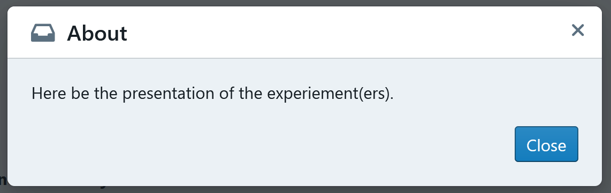

# The Processes and Elements of an Empirica Experiment

### What is a React.js component?

A React.js component is the main building block of the frontend of your Empirica App. There are many tutorials online to help with your understanding of React.js.

In Empirica, we assign certain components for the Intro Steps, the Round, the Exit Steps, and a few other elements of the Game.

A component is composed of:

* **states** that affect what is rendered for the user, but that can also be changed by the user interacting with the rendered elements of the app.
* **props** provided from other components that can be used to determine what is rendered for the user.
* **other components** that it imports and builds into what it renders for the user.
* a **render function** that determines what is shown to the user with a mix of HTML \(with `<> tags`\) and JavaScript \(with `{}`\).

Each component is generally made into one `.jsx` file. Components can be imported into each other to build more complex components. Usually, the type of components used in Empirica are **class-based**.

A major perk of React.js components is that whenever one of their states change \(e.g., because of the action of user\), it will **refresh every component** **affected** and update what is rendered depending on the new states. This makes for web apps that live update what they look like and do. This is particularly useful for Empirica because you want to update what you show to players depending on states such as which responses they have given, which stage of the Game they are at, what other players are doing, etc.

Hence, there are some elements of a component you might want to render differently depending on certain props and states. You can use syntax such as `{ condition ? true : false }`or `{ condition && true}` where _condition_ is a condition that is tested, _true_ is what is rendered if this condition tests true, and _false_ is what is rendered if this condition tests false.

A component might look like this:

```jsx
// Importing elements and other components
import React, { Component } from 'react'
import GivingResponse from './GivingResponse'

export default class Questionnaire extends Component {
    // The state of the questionnaire
    state = {
        showHint: false
    }

    // Handling if the player clicks to show hint (toggles the hint on and off)
    handleShowHint = () => {
        this.setState({ showHint: !this.state.showHint })
    }

    render() {

        // Getting the props
        const { player } = this.props;

        return (
            <div>
                <p> What is the name of the first person to set foot on the moon?</p>

                {/* A button that affects the conditional that
                 determines whether to show the hint or not */}
                <button onClick={this.handleShowHint()}>Show hint</button>
                {this.state.showHint && <p className="hintcolour">He was American.</p>}

                {/* Importing another component for the player to give their answer.
                 We pass down the prop of the player */}
                <GivingResponse player={player} />
            </div>
        )
    }
}
```

### 

### What is the Centered element?

The **Centered element** is a custom element from Empirica that you can use to surround other elements of your components. This will make them centered on the page.

Import the element with:

```text
import { Centered } from "meteor/empirica:core";
```

And use it like this:

```jsx
<Centered>
    
    <div> Other elements </div>
    
</Centered>
```

### 

### How can I modify/hide the About section?

The **About section** is a small window that will upon when players click the top right corner button `About`. For example:



In `client/main.js` is where you set the different elements that your users will interact with. There you can set your custom component for the About section. 

Import the component to the `client/main.js` with:

```text
import <component name> from <path>;
```

And then set it with:

```text
Empirica.about(<component name>);
```

However, setting an About section is completely optional, you can get rid of it by not writing the line above in `client/main.js` or deleting it if it is already written.

### 

### How can I hide the Header?

The **Header** is the blue rectangle at the top of player's screen in an Empirica app. 

See more about the structure of the Header component [here](../overview/api.md#empirica-header-component).

In `client/main.js` is where you set the different elements that your users will interact with. 

Import the component to the `client/main.js` with:

```text
import <component name> from <path>;
```

And then set it with:

```text
Empirica.header(<component name>);
```

Or you can get rid of the Header with:

```text
Empirica.header(() => null);
```

### 

### How can I modify/hide the Breadcrumb?

The **Breadcrumb** is the track at the top of a Round that shows the player which Stage of the Round they are currently at.

See more about the structure of the Breadcrumb component [here](../overview/api.md#empirica-breadcrumb-component).


In `client/main.js` is where you set the different elements that your users will interact with. There you can set your custom component for the Breadcrumb. 

Import the component to the `client/main.js` with:

```text
import <component name> from <path>;
```

And then set it with:

```text
Empirica.breadcrumb(<component name>);
```

Or you can get rid of the Breadcrumb with:

```text
Empirica.breadcrumb(() => null);
```

### 

### How can I modify the page where new players set their id?

By default, there is a **newPlayer page** at the beginning of Empirica games where players provide their id. This could be a name, an MTurk/Prolific id, a student id, an email, etc. You might want to change its design, format, or instructions. For example, if you want participants to provide a student id but no other personal information, you would want to make your own clear instructions.

Here is an example of a personalised newPlayer page:

```jsx
import React, { Component } from 'react';
import { Centered } from "meteor/empirica:core";

export default class PlayerId extends Component {
    state = { id: "" };
    
    // Update the stored state of the id
    handleUpdate = event => {
        const { value, name } = event.currentTarget;
        this.setState({ [name]: value });
    };
    
    // Submit the id when submit button is clicked
    handleSubmit = event => {
        event.preventDefault();

        const { handleNewPlayer } = this.props;
        const { id } = this.state;
        handleNewPlayer(id);
    };

    render() {
        const { id } = this.state;

        return (
            <Centered>
                <div className="new-player">
                    <form onSubmit={this.handleSubmit}>
                        <h1>Identification</h1>

                        <p>
                            Please enter your ID:
                        </p>

                        <input
                            dir="auto"
                            type="text"
                            name="id"
                            id="id"
                            value={id}
                            onChange={this.handleUpdate}
                            required
                            autoComplete="off"
                        />

                        <p className="button-holder">
                            <button type="submit">Submit</button>
                        </p>

                    </form>
                </div>
            </Centered>
        )
    }
}
```

The important parts of your component is to have methods to handle when the player is changing the id they write \(`handleUpdate`\) and when the player clicks the submit button \(`handleSubmit`\) so that in the end it is using the `handleNewPlayer()` method that will set the player's id as the string submitted and move the player to the first Intro Step.

In `client/main.js` is where you set the different elements that your users will interact with. There you can set your custom component for the newPlayer page. 

Import the component to the `client/main.js` with:

```text
import <component name> from <path>;
```

And then set it with:

```text
Empirica.newPlayer(<component name>);
```

### 

### Can I set the player id automatically, via URL?

You can do so by adding a few line to the "public" section of your [settings files](faq.md#what-is-the-settings-file-settings-json). 

```text
"public": { 
    "playerIdParam": "playerIdKey",
    "playerIdParamExclusive": false 
}
```

Where `"playerIdParam"` sets the name of the URL query parameter after which you set the player's id.  For example,  a fake app with these settings, I could set the player id directly in the URL `https://myfakeapp.meteorapp.com/?playerIdKey=3333`.

If `"playerIdParamExclusive"` is set to `true` , then players can only ever participate if their id is set by the `"playerIdParam"` \(i.e., they cannot set their id in the NewPlayer page\), but if it is set to `false`, then players can join both by setting their id at the NewPlayer page and by setting their id with the `"playerIdParam"`.

### 

### How does the stage Timer component work?

There is a `Timer.jsx` component that represents the stage timer and shows players how much time is left at that stage. 

For the Timer to work, the `stage` has to be passed down to it as a prop. For example, in the `PlayerProfile.jsx` of [your first Empirica experiment](../guides/your-first-experiment.md):

```jsx
return (
      <aside className="player-profile">
        {this.renderProfile()}
        {this.renderScore()}
        <Timer stage={stage} />
      </aside>
    );
```

Inside the `Timer.jsx` component, what makes the timer is that it extracts the `remainingSeconds` from the `stage`, and that it imports the `StageTimeWrapper` to export the Timer with `export default (Timer = StageTimeWrapper(timer));`. 

Here is the code for a basic Timer component:

```jsx
import { StageTimeWrapper } from "meteor/empirica:core";
import React from "react";

class timer extends React.Component {
  render() {
    const { remainingSeconds } = this.props;

    const classes = ["timer"];
    if (remainingSeconds <= 5) {
      classes.push("lessThan5");
    } else if (remainingSeconds <= 10) {
      classes.push("lessThan10");
    }

    return (
      <div className={classes.join(" ")}>
        <h4>Timer</h4>
        <span className="seconds">{remainingSeconds}</span>
      </div>
    );
  }
}

export default (Timer = StageTimeWrapper(timer));
```

### 

### Can I customize when players submit their answer to a stage?

Instead of having players wait until the end of the stage, you can have them submit their answer. This will set the Stage as submitted for them. If all the other players have also submitted the Stage, then the players move on to the next Stage or Round.

To set the stage to submitted you need to run this method from the `player` prop:

```text
player.stage.submit()
```

This will change this property, that you can use to see if the stage has been submitted \(it is a Boolean, true or false\):

```text
player.stage.submitted
```

For example, you could create a button, that has a handle method for `onClick` that will do the necessary with the player's answer and call `player.stage.submit()`.

### 

### Can I customize what players see when they have submitted their answer to a stage?

Once a player submits for the stage, you might want to show something different on the screen. For example, instead of showing the stage's question/task \(and avoiding players submitting multiple responses\), you could show a message thanking the player for submitting the stage and telling them that they will have to wait for all players to submit the stage before they can move on to the next one.

You can do this by setting a **conditional** that renders different elements depending on what `player.stage.submitted` returns.

For example:

```jsx
{
player.stage.submitted
    ? <div> Thank you for your answer. The next stage will start when all the other 
    players have submitted their answer. </div>
    : <div><Question player={player} /></div>
}
```

### 

### How can I get rid of the "Waiting on the other players. Please wait until all players are ready"?

This message is not required, but was added manually in the [`Your First Empirica` t](../guides/your-first-experiment.md)utorial.

 As shown in the previous two FAQs, it is possible to use the information that a Player has submitted their Stage to render something different than before they submit their Stage. In your first experiment, this happens in the `TaskResponse.jsx`.  You can see that two **render functions** have been created: `renderSubmitted()` and `renderInput()`. In the `render()` part of the component, you can see that there is an **if conditional** that determines whether the render function used will be `renderSubmitted()`, which will prevent the `renderSubmitted()` from being called \(and thereby hiding the slider and method of response from the player\):

```jsx
render() {
    const { player } = this.props;

    // If the player already submitted, don't show the slider or submit button
    if (player.stage.submitted) {
      return this.renderSubmitted();
    }

    return (
      <div className="task-response">
        <form onSubmit={this.handleSubmit}>
          {this.renderInput()}
          {" "}
          <button type="submit">Submit</button>
        </form>
      </div>
    );
  }
```

You can get rid of this message by taking out the **if conditional**, or changing what `renderSubmitted()` does.

### 

### How can I redirect a player if I detect they are using a certain browser or a mobile device?

You might not want players to join your game from a mobile or tablet, nor from certain browsers. To do so you can use [react-device-detect](https://www.npmjs.com/package/react-device-detect) and modify the first page of your experiment \(e.g., the consent page, the NewPlayer page, or the first page of your Intro Steps\) to prevent them from continuing the experiment if you detect the device or browser that you do not want.

To install react-device-detect use:

```text
meteor npm install react-device-detect
```

react-device-detect has different Booleans that you can import and use in one of your components to detect whether the player is using a certain browser.

* isMobile for whether they are using a mobile device
* isChrome for whether they are using Chrome
* isFirefox for whether they are using Firefox
* isSafari for whether they are using Safari
* ...

And others than you can find out about [here](https://www.npmjs.com/package/react-device-detect).

Import them into the component with:

```text
import { isMobile, isFirefox, isSafari, isChrome } from 'react-device-detect';
```

For example, if you want to render a different consent form if the player is using a mobile device or is not using Chrome:

```jsx
return !isMobile && isChrome ?
(
    <div>This is the consent form...</div>
) :
(
    <div>Please use a computer and Chrome.</div>
)
```

### 

### How can I show a different Exit Step to players depending on whether they have finished the game or if the game was cancelled/had a problem?

In the `client/main.js` you set which components form the **Exit Steps** with `Empirica.exitSteps()`. You can use the `player.exitStatus` to separate out whether they have finished the game or if they were sent to the exit steps because the game was cancelled/had an issue and send them to different Exit Steps.

For example:

```jsx
Empirica.exitSteps((game, player) => {
    return player.exitStatus === "finished"
        ? [PostSurvey, Thanks]
        : [Sorry];
});
```

### 

### Can players navigate back and forth between the Exit Steps?

For now, players cannot navigate back and forth between the Exit Steps. 

Each Exit Step has a name set by `static stepName = "";` and players can only move from one Exit Step to the next if the component has an element \(e.g., a button\) that will call the `onSubmit` prop. For example:

```jsx
<button type="button" onClick={onSubmit}>
    Finish this experiment
</button>
```

If you wanted multiple pages within the Exit Steps that players can navigate through, you could create a component within one Exit Step that has different components to form "pages" and with a state that knows which page it is at and navigating to and from them.

### 

### Can a manually sent a player to an exit step?

You can have a piece of code to manually send a player to an exit stage if they do something \(e.g., you want to give them a quit button\) by using:

```text
player.exit("name of exit step")
```

where the string is the name of the exit stage you want to send them to.

### 

### How can I use bots?

In the `server/bots.js` you can create bots for them to participate in your games.

```jsx
Empirica.bot("bob", {
  // // NOT SUPPORTED Called at the beginning of each stage (after onRoundStart/onStageStart)
  // onStageStart(bot, game, round, stage, players) {},

  // Called during each stage at tick interval (~1s at the moment)
  onStageTick(bot, game, round, stage, secondsRemaining) {}

  // // NOT SUPPORTED A player has changed a value
  // // This might happen a lot!
  // onStagePlayerChange(bot, game, round, stage, players, player) {}

  // // NOT SUPPORTED Called at the end of the stage (after it finished, before onStageEnd/onRoundEnd is called)
  // onStageEnd(bot, game, round, stage, players) {}
});
```

### 

### How can I add a chat between players?

To add a chat  in Empirica, you can use our simple solution by using the **Empirica Chat**. For detailed information about Empirica Chat, see [here](https://github.com/empiricaly/chat).

#### Installing

First, install Empirica Chat with:

```text
meteor npm install --save @empirica/chat
```

#### Import and Usage

Then, in the components you want to use the chat, import this:

```text
import { Chat } from "@empirica/chat";
```

Then you can create the chat component with:

```text
<Chat player={player} scope={game} />
```

`chat` expects 2 required props:

* `player`: the current player
* `scope`: object that the chat will be attached to, can be game, round, or stage objects.

`Chat` also displays a name for each participant, which you need to set in the experiment independently of the `playerId`: `player.set('name', "myPseudonym")`

#### Multiple chat instances within the same scope

You can pass an optional `customKey` string prop to differentiate different chats within the same scope. This changes which get/set key on the given scope the chat will be recorded.

```text
<Chat player={player} scope={game} customKey="casual_chat" />
```

#### Adding timestamp to chat message

You can pass an optional `timeStamp` date prop to add the timestamp attribute on each message sent. Run this command to add mizzao timesync `meteor add mizzao:timesync`.

```text
// reactive time value only updates at 1000 ms
const timeStamp = new Date(TimeSync.serverTime(null, 1000));

<Chat player={player} scope={game} timeStamp={timeStamp} />
```

#### Other functionalities

There are many other functionalities with Empirica chat that you can see [here](https://github.com/empiricaly/chat).

