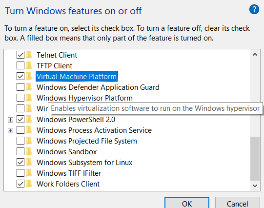
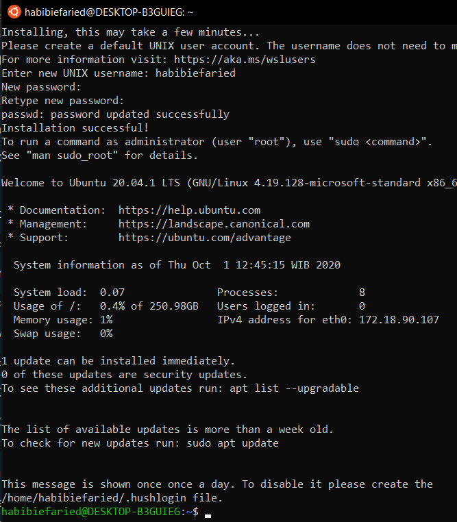
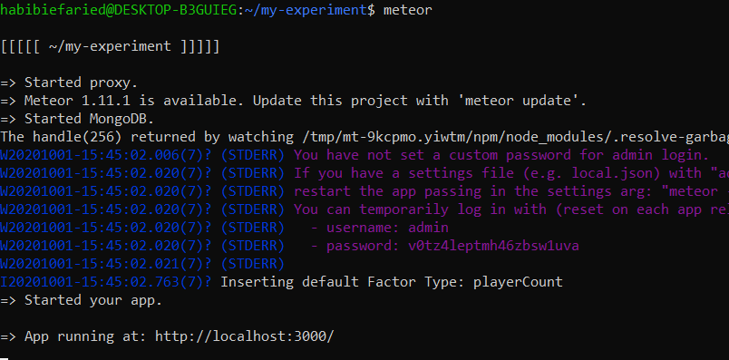

# Installing Developer Tools in Windows

If you are a windows user, you must first complete this guide in order to install the necessary developer tools for Windows.  If you are a MacOS/Linux user, you can proceed to 'Quick Start.'

## Overview

### This guide will proceed through the following steps.

1. **Install and configure the latest version of Windows Linux Subsystem \(WSL2\).** \*\*Step 1 is the most involved component\*\*
2. **Within WLS, install NVM.**
3. **Within WLS, install Meteor.**
4. **Proceed with Quick Start instructions.**

## 1.  Install WSL 2 and Ubuntu 20.04

In order to install WSL2 and Ubuntu 20.04, follow the steps in this guide:  [https://docs.microsoft.com/en-us/windows/wsl/install-win10](https://docs.microsoft.com/en-us/windows/wsl/install-win10)

#### Here is a summary with some helpful screenshots:

1. Enable the Windows Subsystem for Linux
2. Ensure you meet the requirements for WSL2
3. Enable the Virtual Machine feature in Windows \(see screenshot below\)
4. Download the WSL2 update package
5. Set WSL2 as your default Linux system
6. Open Microsoft store, search for Ubuntu 20.04, and install it 
7. Launch the terminal and follow the prompt to create a new username/password \(see screenshot below\).

#### Enabling Virtual Machine feature in Windows: 




#### Running Ubuntu 20.04 in Windows for the first time: 



### 

## 2.  Install NVM

Our instructions follow this guide: [https://tecadmin.net/install-nodejs-with-nvm/](https://tecadmin.net/install-nodejs-with-nvm/)

Enter the following commands into your Ubuntu terminal.

```text
curl https://raw.githubusercontent.com/creationix/nvm/master/install.sh | bash  # Download and install
source ~/.profile  # Reload system environment
nvm install v14.5.0
```

## 3. Install Meteor

Enter the following command:

```text
nvm install lts/erbium
```

## 4. Follow the Empirica Quick-Start guide.

Enter the following commands:

```text
npx create-empirica-app my-experiment
cd my-experiment
meteor
```

#### Once Empirica is running, it looks like this:



