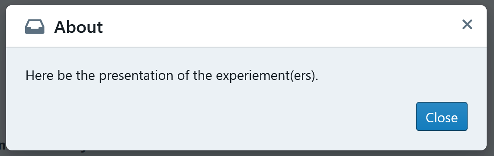
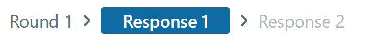

# FAQ

## About Empirica

### What is Empirica?

Empirica is an open-source JavaScript framework for running multiplayer interactive experiments and games in the browser. It was created to make it easy to develop and iterate on sophisticated designs in a statistically sound manner, and offers a unique combination of power, flexibility, and speed. Empirica is a powerful framework that facilitates the management of your games and experiments, and is useful even for singleplayer research. 

Empirica is built on a combination of [Meteor](https://www.meteor.com/) for the backend \(managing your games and data\) and [React.js](https://reactjs.org/) for the frontend \(what the players see and interact with\). Empirica provides a helpful structure to how your Games, Players, Rounds, and Stages interact. Furthermore, Empirica provides you with an Admin Panel that makes organising and running your Games for data collection extremely easy and intuitive.

Empirica is the one method that provides enough flexibility to build any type of experiment whilst still being accessible and helpful to the researcher. 

### I want to use Empirica, where do I start?

Visit the [Quick Start](../getting-started/setup/) part of this documentation to get you started. 

To learn more about the parts of an Empirica app \(e.g., what are Games, Rounds, and Players?\) visit the [Concepts ](concepts.md)page.

Read the rest of this FAQ for more information about specific process when using Empirica.

### What skills do I need to use Empirica?

Empirica helps you build online apps for online research. As with many online tools, basic notions of HTML, CSS, and JavaScript will be helpful. As Empirica is built with Meteor and React.js, knowing a bit about those can also be helpful, although you do not need to be an expert. There are many tutorials online that teach the basics of all the technologies mentioned here.

### Why should I use Empirica instead of just Meteor and React.js together?

Whilst Meteor and React.js are powerful tools, and you could build sophisticated experiments with them, Empirica makes the process of building and managing your experiments much easier. 

Notably, Empirica provides an Admin Panel that allows you to manage the conditions of your experiments \(Treatments and Factors\) and which Games are running, collecting data, or waiting for players.

### I have a question about how to do something in Empirica, where can I ask it?

If you want to ask questions about how to do something in Empirica, get in touch so that you can join the Empirica Slack. Especially the `tech-support-not-bug-report` channel.

### I have a bug/technical issue with Empirica, where should I mention it?

If you encounter a technical issue or a bug with Empirica, please create a GitHub issue [here](https://github.com/empiricaly/meteor-empirica-core/issues).

## Setup, Deployment, and Hosting

### What is the general setup and structure of an Empirica app?

Empirica allows you to build powerful apps for multiplayer and singleplayer research. It is made of these important components:

* Your **code**.
  * The backend \(managing your games and data\) with Meteor
  * The frontend \(what the players see and interact with\) with React.js
* An **Admin Panel** that allows you manage the conditions, games, and players in your experiment.
* A connection to a **database**, such as MongoDB Atlas, to store your data that can be accessed and modified live by your experiment.
* The app is deployed to a **hosting service**, such as Meteor Galaxy, so that your experiment is online and you can send a **link** for players to connect to it.


Many aspects of your app need to be set in a **settings file**, usually called `settings.json`.

We explain how yo connect to [MongoDB Atlas](https://www.mongodb.com/cloud/atlas) and how to deploy to [Meteor Galaxy](https://www.meteor.com/cloud) \(a service directly proposed by Meteor\) because those are easy to use and popular services. Of course, you can use other services for databases and hosting, if you would like. The information here would still be helpful to you.

### What is the settings file \(settings.json\)?

You will need to create a **settings file** to set up your app. This will be a `.json` file, which is usually named`settings.json` \(or `local.json` or `deploy.json`\), but you can name it anyway you want, as long as your point to it when launching and deploying the app.

**The settings file will contain information that you do not want to share with the public**, such as your admin password and a link to your database. Hence you should keep it private. If you put your code on an online version-control repository \(e.g., GitHub\), we suggest you do not make your settings file available there. For example, you could add the name of your settings file to the `.gitignore` file of your project.

The settings file is made of a JSON object `{}` in which there are other objects `"name": {}` separated by `,`such as the `"public"`  object that allows you to set specific aspects of your Empirica app \(e.g., [setting the player id with a URL query](faq.md#can-i-set-the-player-id-via-url-query)\):

```text
{
    "galaxy.meteor.com": {
        
    },
    "admins": [
        {
            "username": "myusername",
            "password": "mypassword"
        }
    ],
    "public": {
        "setting": "mysetting"  
    }
}
```

The settings file is also useful for [creating admin identifiers](faq.md#can-i-set-a-personalised-admin-login) for the admin panel and for [connecting your app to your MongoDB database](faq.md#how-do-i-connect-my-app-to-mongodb-atlas).

To run your app locally with your settings as set in the settings file, use:

```text
meteor --settings settings.json
```

### How do I connect my app to MongoDB Atlas?

Firstly, you need to create an account on [MongoDB Atlas](https://www.mongodb.com/cloud/atlas). 

Then you should set up a **project**. A project can contain multiple **clusters**, which can contain multiple **databases**, which can contain multiple **collections**. You can share access to your project with collaborators if you wish. 

#### Clusters

In your project, got to _clusters_ and click on _Create a New Cluster_. You can select the provider, region, and tier of your cluster. See [here](faq.md#what-should-be-the-scale-of-my-mongodb-cluster) which tier of cluster you should choose. It takes a few minutes for the cluster to become operational.

#### Users

In _Database Access_, click _add new database user_. You want to  create a Read&Write user by creating a user an that has a username, a password, and _Read and write to any database_ privileges.

It is also useful to create an OPLOG user. You can create one the same way as the Read&Write user, with a username and a password, but for the privileges select _Grant specific privileges_ and have the specific privileges be `read @ local` \(leave the Collection blank\).

#### Network Access

In _Network Access_, click _add ip addresses_ to set the IP addresses that are allowed to access your databases. Technically, someone using your app 'needs to access your databases' \(through your app, not directly\), so if you want any player to be able to play your game, you should set the IP address to any IP address \(whitelist\): 0.0.0.0/0

#### Databases

In your cluster, click _collections_ and then _create database_ where you will set the name of your database and its first collection. The name of the collection isn't very important, because most of the collections of interest will be generated by your Empirica app once it is connected to the database. 

#### Connecting to your app

In your cluster, click _connect_, then click _connect your application_. It will open a window where you should select _Node.js_ as the driver. It also presents a **URI** that you will need to copy to connect your app to your database.

You do not need the `?retryWrites=true&w=majority` part.

The important part that this URI provides you is the part between the `@` and the `<dbname>`, it is the **connection**.

In your [settings file](faq.md#what-is-the-settings-json), you will have to add this JSON object:

```text
    "galaxy.meteor.com": {
        "env": {
            "MONGO_URL": "mongodb+srv://<read&write username>:<read&write password>@<connection>/<database name>",
            "MONGO_OPLOG_URL": "mongodb+srv://<oplog username>:<oplog password>@<connection>/local"
        }
    },
```

Fill in the &lt;&gt; parts with the appropriate elements from when you created the [users ](faq.md#users)and the [database](faq.md#databases). The connection is mentioned above.

Now, when you [deploy your app with the settings file](faq.md#how-do-i-deploy-my-app-to-galaxy) or when you [launch it locally with the settings file](faq.md#what-is-the-settings-json), you will be connected to the database. Once you start using your app connected to the database, your should be able to verify that everything worked by refreshing your page on your cluster's database: You will see all the collections relevant to an Empirica app appear \(games, players, treatments, etc.\).

### What should be the scale of my MongoDB cluster?

The **sandbox** tier allows you to test out a free cluster with a limited storage space. This is perfect for development. However, you want to have more power, space, and guaranties when you deploy your app and start collecting data. Unless you plan on collecting a lot of data, an **M10 tier** is a good place to start. **Please note the fees involved in cluster tiers other than sandbox.**

### MongoDB Atlas sent me an email about Query Targeting, should I be worried?

If you regularly receive emails about `Query Targeting: Scanned Objects / Returned has gone above 1000`, and you haven't been making custom queries to the database, then it is very unlikely that this is a problem. Verify that your data is complete as it should. If it is, then this is probably because the long running query to the oplog does end up reading over 1000 records, but that’s normal, and Atlas does not know it’s a normal behavior that does not impact performance. It should be safe to [disable this notification in the Atlas admin](https://docs.atlas.mongodb.com/configure-alerts/#disable-an-alert).

### How do I deploy my app to Galaxy?

[Galaxy](https://www.meteor.com/cloud) \(also called Meteor Cloud\) is a hosting service provided by Meteor. For a full guide on deploying to Galaxy, see [here](https://galaxy-guide.meteor.com/deploy-guide.html).

#### Registering and logging in

The first step is to register an account with Meteor Galaxy. **Please note the fees involved in hosting with Galaxy.**

Then, in your app's command line, you should log into your Meteor Galaxy account with:

```text
meteor login
```

It will then prompt you for your username and password.

To see which account is currently logged into your app you can type:

```text
meteor whoami
```

#### Hostname

A **hostname** is the name that the public will use to access your app. 

Part of the hostname is the **domain name**. You can use a custom domain name if you own one, or use one of those offered by Galaxy. If you are using the offered domain, use `.meteorapp.com` for apps deployed to the US East region, `.eu.meteorapp.com` for apps deployed to the EU West region, or `.au.meteorapp.com` for apps deployed to the Asia-Pacific region

For example, a complete hostname with a Galaxy offered domain could be: `my-game-study-example.meteorapp.com`

This, combined with _https://_ is the link you will send players for them to access your app.

#### DEPLOY\_HOSTNAME

You will need to enter a DEPLOY\_HOSTNAME variable depending on your location:

* To deploy to US East: `DEPLOY_HOSTNAME=galaxy.meteor.com`
* To deploy to EU West: `DEPLOY_HOSTNAME=eu-west-1.galaxy.meteor.com`
* To deploy to Asia-Pacific: `DEPLOY_HOSTNAME=ap-southeast-2.galaxy.meteor.com`

#### Deploying

Once you have selected a hostname and a DEPLOY\_HOSTNAME variable, you need to type the following commands to deploy your app to Galaxy with your [settings file](faq.md#what-is-the-settings-json).



`DEPLOY_HOSTNAME=galaxy.meteor.com meteor deploy [hostname] --settings settings.json`



  
`SET DEPLOY_HOSTNAME=galaxy.meteor.com`

`meteor deploy [hostname] --settings settings.json`



Note that deploying an app **takes a few minutes!**

Once it is done, you can go to [https://galaxy.meteor.com/](https://galaxy.meteor.com/) to check on your apps. You can inspect their **logs** and modify their **settings**. 

If you run the commands to deploy the app again, it will redeploy the app with any changes you have made since your last deployment.

### What should the scale of my hosting service be?

The size of the Galaxy hosting is determined by **containers** of different size. You can have multiple containers of the same size. This will determine how many players and games can co-occur on your deployed app. **Please note the fees involved in hosting with Galaxy.**

**You may be able to get a single Tiny container for a free plan \(check your Meteor Cloud/Galaxy account\).** However, the Tiny containers will be insufficient for collecting data. You will want bigger containers. The exact size depends on how many players will be using your app concurrently an how demanding your app is. The most basic way of finding out the right size for you is to test your deployed app with different containers whilst monitoring the CPU usage. 

### I downloaded an Empirica app from GitHub, how do I make sure it has everything I need to use it?

If you download an app from a GitHub, such as the **community demos**, it is likely that there will be some missing parts:

* Not all of the NPM, Meteor, and React.js [packages will be installed](faq.md#how-can-i-make-sure-all-the-packages-in-my-app-are-installed).
* There will be no [settings file](faq.md#what-is-the-settings-file-settings-json), you might need to create your own and [connect it to your own database](faq.md#how-do-i-connect-my-app-to-mongodb-atlas).
* You might need to [import the treatments and factors](faq.md#can-i-import-and-export-my-treatments-factors-and-lobby-settings).

### How can I make sure all the packages in my app are installed?

When an Empirica app is sent to and downloaded from a remote repository like GitHub, it will not have all the packages installed. Instead, the `package.json` and `package-lock.json` files keep track of all the packages the app needs.

You will get error messages if you try to run the app without all the packages it needs installed.

To have it install all the packages it needs, use:

```text
meteor npm install
```

### Can I import and export my treatments, factors, and lobby settings?

In the **configuration** tab of the Admin Panel of your app there are **Import** and **Export** buttons. 

The **Export** button will produce a `.yaml` file of your treatments and factors.

The **Import** button will allow you to select a `.yaml` file to set the treatments and factors.

If you want to share your app with someone, it is important to provide this `.yaml` so that they can use the same treatments and factors as you.

## The Processes and Elements of an Empirica App

### What is a React.js component?

A React.js component is the main building block of the frontend of your Empirica App. There are many tutorials online to help with your understanding of React.js.

In Empirica, we assign certain components for the Intro Steps, the Round, the Exit Steps, and a few other elements of the Game.

A component is composed of:

* **states** that affect what is rendered for the user, but that can also be changed by the user interacting with the rendered elements of the app.
* **props** provided from other components that can be used to determine what is rendered for the user.
* **other components** that it imports and builds into what it renders for the user.
* a **render function** that determines what is shown to the user with a mix of HTML \(with `<> tags`\) and JavaScript \(with `{}`\).

Each component is generally made into one `.jsx` file. Components can be imported into each other to build more complex components. Usually, the type of components used in Empirica are **class-based**.

A major perk of React.js components is that whenever one of their states change \(e.g., because of the action of user\), it will **refresh every component** **affected** and update what is rendered depending on the new states. This makes for web apps that live update what they look like and do. This is particularly useful for Empirica because you want to update what you show to players depending on states such as which responses they have given, which stage of the Game they are at, what other players are doing, etc.

Hence, there are some elements of a component you might want to render differently depending on certain props and states. You can use syntax such as `{ condition ? true : false }`or `{ condition && true}` where _condition_ is a condition that is tested, _true_ is what is rendered if this condition tests true, and _false_ is what is rendered if this condition tests false.

A component might look like this:

```text
// Importing elements and other components
import React, { Component } from 'react'
import GivingResponse from './GivingResponse'

export default class Questionnaire extends Component {
    // The state of the questionnaire
    state = {
        showHint: false
    }

    // Handling if the player clicks to show hint (toggles the hint on and off)
    handleShowHint = () => {
        this.setState({ showHint: !this.state.showHint })
    }

    render() {

        // Getting the props
        const { player } = this.props;

        return (
            <div>
                <p> What is the name of the first person to set foot on the moon?</p>

                {/* A button that affects the conditional that
                 determines whether to show the hint or not */}
                <button onClick={this.handleShowHint()}>Show hint</button>
                {this.state.showHint && <p className="hintcolour">He was American.</p>}

                {/* Importing another component for the player to give their answer.
                 We pass down the prop of the player */}
                <GivingResponse player={player} />
            </div>
        )
    }
}

```

### What is the Centered element?

The **Centered element** is a custom element from Empirica that you can use to surround other elements of your components. This will make them centered on the page.

Import the element with:

```text
import { Centered } from "meteor/empirica:core";
```

And use it like this:

```text
<Centered>
    
    <div> Other elements </div>
    
</Centered>

```

### How can I modify/hide the About section?

The **About section** is a small window that will upon when players click the top right corner button `About`. For example:



In `client/main.js` is where you set the different elements that your users will interact with. There you can set your custom component for the About section. 

Import the component to the `client/main.js` with:

```text
import <component name> from <path>;
```

And then set it with:

```text
Empirica.about(<component name>);
```

However, setting an About section is completely optional, you can get rid of it by not writing the line above in `client/main.js` or deleting it if it is already written.

### How can I hide the Header?

The **Header** is the blue rectangle at the top of player's screen in an Empirica app. 

See more about the structure of the Header component [here](api.md#empirica-header-component).

In `client/main.js` is where you set the different elements that your users will interact with. 

Import the component to the `client/main.js` with:

```text
import <component name> from <path>;
```

And then set it with:

```text
Empirica.header(<component name>);
```

Or you can get rid of the Header with:

```text
Empirica.header(() => null);
```

### How can I modify/hide the Breadcrumb?

The **Breadcrumb** is the track at the top of a Round that shows the player which Stage of the Round they are currently at.

See more about the structure of the Breadcrumb component [here](api.md#empirica-breadcrumb-component).



In `client/main.js` is where you set the different elements that your users will interact with. There you can set your custom component for the Breadcrumb. 

Import the component to the `client/main.js` with:

```text
import <component name> from <path>;
```

And then set it with:

```text
Empirica.breadcrumb(<component name>);
```

Or you can get rid of the Breadcrumb with:

```text
Empirica.breadcrumb(() => null);
```

### How can I modify the page where new players set their id?

There is a **newPlayer page** at the beginning of Empirica games where players provide their id. This could be a name, an MTurk/Prolific id, a student id, an email, etc. You might want to change its design, format, or instructions. For example, if you want participants to provide a student id but no other personal information, you would want to make your own clear instructions.

Here is an example of a personalised newPlayer page:

```text
import React, { Component } from 'react';
import { Centered } from "meteor/empirica:core";

export default class PlayerId extends Component {
    state = { id: "" };
    
    // Update the stored state of the id
    handleUpdate = event => {
        const { value, name } = event.currentTarget;
        this.setState({ [name]: value });
    };
    
    // Submit the id when submit button is clicked
    handleSubmit = event => {
        event.preventDefault();

        const { handleNewPlayer } = this.props;
        const { id } = this.state;
        handleNewPlayer(id);
    };

    render() {
        const { id } = this.state;

        return (
            <Centered>
                <div className="new-player">
                    <form onSubmit={this.handleSubmit}>
                        <h1>Identification</h1>

                        <p>
                            Please enter your student ID:
                        </p>

                        <input
                            dir="auto"
                            type="text"
                            name="id"
                            id="id"
                            value={id}
                            onChange={this.handleUpdate}
                            placeholder="e.g. 1111111111"
                            required
                            autoComplete="off"
                        />

                        <p className="button-holder">
                            <button type="submit">Submit</button>
                        </p>

                    </form>
                </div>
            </Centered>
        )
    }
}

```

The important parts of your component is to have methods to handle when the player is changing the id they write \(`handleUpdate`\) and when the player clicks the submit button \(`handleSubmit`\) so that in the end it is using the `handleNewPlayer()` method that will set the player's id as the string submitted and move the player to the first Intro Step.

In `client/main.js` is where you set the different elements that your users will interact with. There you can set your custom component for the newPlayer page. 

Import the component to the `client/main.js` with:

```text
import <component name> from <path>;
```

And then set it with:

```text
Empirica.newPlayer(<component name>);
```

### Can I set the player id via URL query?

You can do so by adding a few line to the "public" section of your [settings files](faq.md#what-is-the-settings-file-settings-json). 

```text
"public": { 
    "playerIdParam": "playerIdKey",
    "playerIdParamExclusive": false 
}
```

Where `"playerIdParam"` sets the name of the URL query parameter after which you set the player's id.  For example,  a fake app with these settings, I could set the player id directly in the URL `https://myfakeapp.meteorapp.com/?playerIdKey=3333`.

If `"playerIdParamExclusive"` is set to `true` , then players can only ever participate if their id is set by the `"playerIdParam"` \(i.e., they cannot set their id in the NewPlayer page\), but if it is set to `false`, then players can join both by setting their id at the NewPlayer page and by setting their id with the `"playerIdParam"`.

### How does the stage Timer component work?

There is a `Timer.jsx` component that represents the stage timer and shows players how much time is left at that stage. 

For the Timer to work, the `stage` has to be passed down to it as a prop. For example, in the `PlayerProfile.jsx` of [your first Empirica experiment](../getting-started/your-first-experiment.md):

```text
return (
      <aside className="player-profile">
        {this.renderProfile()}
        {this.renderScore()}
        <Timer stage={stage} />
      </aside>
    );
```

Inside the `Timer.jsx` component, what makes the timer is that it extracts the `remainingSeconds` from the `stage`, and that it imports the `StageTimeWrapper` to export the Timer with `export default (Timer = StageTimeWrapper(timer));`. 

Here is the code for a basic Timer component:

```text
import { StageTimeWrapper } from "meteor/empirica:core";
import React from "react";

class timer extends React.Component {
  render() {
    const { remainingSeconds } = this.props;

    const classes = ["timer"];
    if (remainingSeconds <= 5) {
      classes.push("lessThan5");
    } else if (remainingSeconds <= 10) {
      classes.push("lessThan10");
    }

    return (
      <div className={classes.join(" ")}>
        <h4>Timer</h4>
        <span className="seconds">{remainingSeconds}</span>
      </div>
    );
  }
}

export default (Timer = StageTimeWrapper(timer));
```

### Can I customise when players submit their answer to a stage?

Instead of having players wait until the end of the stage, you can have them submit their answer. This will set the Stage as submitted for them. If all the other players have also submitted the Stage, then the players move on to the next Stage or Round.

To set the stage to submitted you need to run this method from the `player` prop:

```text
player.stage.submit()
```

This will change this property, that you can use to see if the stage has been submitted \(it is a Boolean, true or false\):

```text
player.stage.submitted
```

For example, you could create a button, that has a handle method for `onClick` that will do the necessary with the player's answer and call `player.stage.submit()`.

### Can I customise what players see when they have submitted their answer to a stage?

Once a player submits for the stage, you might want to show something different on the screen. For example, instead of showing the stage's question/task \(and avoiding players submitting multiple responses\), you could show a message thanking the player for submitting the stage and telling them that they will have to wait for all players to submit the stage before they can move on to the next one.

You can do this by setting a **conditional** that renders different elements depending on what `player.stage.submitted` returns.

For example:

```text
{
player.stage.submitted
    ? <div> Thank you for your answer. The next stage will start when all the other 
    players have submitted their answer. </div>
    : <div><Question player={player} /></div>
}
```

### How can I get rid of the "Waiting on the other players. Please wait until all players are ready"?

This message is not something special shown to players once they have submitted a response to a stage. This is simply a part of how [your first Empirica experiment](../getting-started/your-first-experiment.md) is built.

 As shown in the previous two FAQs, it is possible to use the information that a Player has submitted their Stage to render something different than before they submit their Stage. In your first experiment, this happens in the `TaskResponse.jsx`.  You can see that two **render functions** have been created: `renderSubmitted()` and `renderInput()`. In the `render()` part of the component, you can see that there is an **if conditional** that determines whether the render function used will be `renderSubmitted()`, which will prevent the `renderSubmitted()` from being called \(and thereby hiding the slider and method of response from the player\):

```text
render() {
    const { player } = this.props;

    // If the player already submitted, don't show the slider or submit button
    if (player.stage.submitted) {
      return this.renderSubmitted();
    }

    return (
      <div className="task-response">
        <form onSubmit={this.handleSubmit}>
          {this.renderInput()}
          {" "}
          <button type="submit">Submit</button>
        </form>
      </div>
    );
  }
```

You can get rid of this message by taking out the **if conditional**, or changing what `renderSubmitted()` does.

### How can I redirect a player if I detect they are using a certain browser or a mobile device?

You might not want players to join your game from a mobile or tablet, nor from certain browsers. To do so you can use [react-device-detect](https://www.npmjs.com/package/react-device-detect) and modify the first page of your experiment \(e.g., the consent page, the NewPlayer page, or the first page of your Intro Steps\) to prevent them from continuing the experiment if you detect the device or browser that you do not want.

To install react-device-detect use:

```text
meteor npm install react-device-detect
```

react-device-detect has different Booleans that you can import and use in one of your components to detect whether the player is using a certain browser.

* isMobile for whether they are using a mobile device
* isChrome for whether they are using Chrome
* isFirefox for whether they are using Firefox
* isSafari for whether they are using Safari
* ...

And others than you can find out about [here](https://www.npmjs.com/package/react-device-detect).

Import them into the component with:

```text
import { isMobile, isFirefox, isSafari, isChrome } from 'react-device-detect';
```

For example, if you want to render a different consent form if the player is using a mobile device or is not using Chrome:

```text
return !isMobile && isChrome ?
(
    <div>This is the consent form...</div>
) :
(
    <div>Please use a computer and Chrome.</div>
)
```

### How can I show a different Exit Step to players depending on whether they have finished the game or if the game was cancelled/had a problem?

In the `client/main.js` you set which components form the **Exit Steps** with `Empirica.exitSteps()`. You can use the `player.exitStatus` to separate out whether they have finished the game or if they were sent to the exit steps because the game was cancelled/had an issue and send them to different Exit Steps.

For example:

```text
Empirica.exitSteps((game, player) => {
    return player.exitStatus === "finished"
        ? [PostSurvey, Thanks]
        : [Sorry];
});
```

### Can players navigate back and forth between the Exit Steps?

For now, players cannot navigate back and forth between the Exit Steps. 

Each Exit Step has a name set by `static stepName = "";` and players can only move from one Exit Step to the next if the component has an element \(e.g., a button\) that will call the `onSubmit` prop. For example:

```text
<button type="button" onClick={onSubmit}>
    Finish this experiment
</button>
```

If you wanted multiple pages within the Exit Steps that players can navigate through, you could create a component within one Exit Step that has different components to form "pages" and with a state that knows which page it is at and navigating to and from.

### Can a manually sent a player to an exit step?

You can have a piece of code to manually send a player to an exit stage if they do something \(e.g., you want to give them a quit button\) by using:

```text
player.exit("name of exit step")
```

where the string is the name of the exit stage you want to send them to.

### How can I use bots?

In the `server/bots.js` you can create bots for them to participate in your games.

```text
Empirica.bot("bob", {
  // // NOT SUPPORTED Called at the beginning of each stage (after onRoundStart/onStageStart)
  // onStageStart(bot, game, round, stage, players) {},

  // Called during each stage at tick interval (~1s at the moment)
  onStageTick(bot, game, round, stage, secondsRemaining) {}

  // // NOT SUPPORTED A player has changed a value
  // // This might happen a lot!
  // onStagePlayerChange(bot, game, round, stage, players, player) {}

  // // NOT SUPPORTED Called at the end of the stage (after it finished, before onStageEnd/onRoundEnd is called)
  // onStageEnd(bot, game, round, stage, players) {}
});
```

### How can I add a chat between players?

To add a chat  in Empirica, you can use our simple solution by using the **Empirica Chat**. For detailed information about Empirica Chat, see [here](https://github.com/empiricaly/chat).

#### Installing

First, install Empirica Chat with:

```text
meteor npm install --save @empirica/chat
```

#### Import and Usage

Then, in the components you want to use the chat, import this:

```text
import { Chat } from "@empirica/chat";
```

Then you can create the chat component with:

```text
<Chat player={player} scope={game} />;
```

`chat` expects 2 required props:

* `player`: the current player
* `scope`: object that the chat will be attached to, can be game, round, or stage objects.

`Chat` also displays a name for each participant, which you need to set in the experiment independently of the `playerId`: `player.set('name', "myPseudonym")`

#### Multiple chat instances within the same scope

You can pass an optional `customKey` string prop to differentiate different chats within the same scope. This changes which get/set key on the given scope the chat will be recorded.

```text
<Chat player={player} scope={game} customKey="casual_chat" />
```

#### Adding timestamp to chat message

You can pass an optional `timeStamp` date prop to add the timestamp attribute on each message sent. Run this command to add mizzao timesync `meteor add mizzao:timesync`.

```text
// reactive time value only updates at 1000 ms
const timeStamp = new Date(TimeSync.serverTime(null, 1000));

<Chat player={player} scope={game} timeStamp={timeStamp} />;
```

#### Other functionalities

There are many other functionalities with Empirica chat that you can see [here](https://github.com/empiricaly/chat).

## Using my App: Administrating Players and Games

### Can I set a personalised admin login?

Yes, and you should, especially because, once deployed, reading the logs of your app to find the randomly generated admin password won't be as easy as reading it from your local console.

In your [settings file](faq.md#what-is-the-settings-file-settings-json), you should add a section to set admin user identifiers. If you deploy the app or launch the app locally with these settings, it will allow you to log into the Admin Panel with the identifiers you have created.

```text
"admins": [
        {
            "username": "myUsername",
            "password": "myPassword"
        }
    ],
```

### When are players playing synchronously and asynchronously? Can I modify this?

Players are **asynchronous during the Intro Steps** \(i.e., they can finish each part at their own pace\). At the **lobby**, players have to wait for each other to finish the Intro Steps. Then players are **synchronous during the Game** \(i.e., they must all finish a Stage before they can move on to the next Stage or Round\). Finally, once all the players have finished the Game, they are **asynchronous again during the Exit Steps**.

It is not recommended to try and modify this aspect of an Empirica app. You should consider what you want players to be doing at their own pace and what you want them to be doing synchronously. Remember that you can use your Treatments to modify how certain aspects of the game are presented throughout the app, and you can set different times for different Stages.

For more information about the life cycle of a game, see [here](lifecycle/).

### Can players leave and re-join the app? Can players refresh the page?

Yes, the browser cache of the player records they Player id and the database records the status and position of the Player, so it knows whether the Player is in the Intro Steps, the Lobby, a specific Round and Stage, or the Exit Steps. If a player refreshes the page or leaves and comes back, they will be sent back to their position. 

However, remember that in Stages the timer is still ticking and during the Intro Steps other players might be waiting in the lobby; hence, it is not a good idea for players to leave the game.

It can be useful for players to know that they can safely refresh the page in case they have a graphical bug or if the page takes too long to render.

### What do the assignment methods 'simple' and 'complete' do?

These are different methods for randomly allocating players to different Games.

When you create a Batch, you can create multiple games within it, and these games can have different treatments. With experiments, one usually wants to randomly allocate players across the different games \(Treatments\).

**Simple** will randomly allocate players to either of the games. Imagine rolling a die for each player to determine which game they are sent to. This might lead to situations where more than the maximum number of players of a game are allocated to a game. In that case, the first players to reach the lobby will be those who get the play the game and the others will be unable to join and their status will be set to `gameFull`.

Complete will randomly allocate players to either of the games except those who already have the maximum number of players. This avoids the potential gameFull issue of the simple allocation method.

### What's the difference between X batches of 1 game each or 1 batch of X games?

The assignment of players to games is done in batches sequentially and within each batch players will be randomly assigned to one game. Therefore, when you have 1 batch with multiple games, players will be assigned randomly to each of the X games according to the assignment method. This means it's possible that none of the games fill up even though enough players join for at least one game to proceed past the lobby as the players are distributed across various games. This would not happen if each batch has only one game: the first game will fill up with the first players who move past the lobby and the remaining players will transition to the game in the second batch.

If you want to ensure the maximum possible number of players get assigned to a game, a good strategy would be to start batches each with 1 game per each treatment condition. For example, if you have two treatment conditions of 8 players each, your batches should contain 1 game of each treatment. This way you can be sure if 16 players join, all 16 will be randomized between only 2 games and you don't lose any of your players in games that never fill up.

This approach however has a drawback as it does not randomize between palyers with different arrival time or completion time of instructions.

### How can I assign players to different versions of my game based on a condition set outside of the game?

Imagine you have players that have different favourite colors, and you want to create games with one player for each favourite color. This is currently hard to make with Empirica because the players are allocated to a game and then they are asked questions, not the other way round.

One solution could be to create a big game, and ask players their favourite color in the Intro Steps. Then, during the [gameInit\(\)](lifecycle/) you assign participants to subgames. This might be complicated because you might have the wrong proportions of players per color. 

Another solution is to create the groups outside of Empirica and invite them one group at a time to a game.

Upcoming updates to Empirica will propose novel solutions to this problem.

### Retiring Players: How players can play again, even if they got gameFull, LobbyTimedOut, etc.

Players can only play once. If there was a problem \(e.g., the lobby timed out or the game was full\), or if you want players to play again, you can _retire_ them which allows them to play again.

In the **Admin Panel**,  in the **monitoring tab**, in the **players tab**, you can see the status of every Player. At the bottom of the page, you can select a type of **exit status** and retire every player with that status.

Once _retired_, players can refresh their page/return to the link of your game and they will be randomly allocated to a game with the same treatment as before. They are allocated to a game with the same treatment so that they don't discover a game with different conditions or instructions.

### I tried to retire a player but got this error: Failed to return players: Error: ID cannot exceed 256 characters in players update \[400\], what should I do?

This means that the player id of the player was too long. If you go to your data base you can find that player and modify their player id so that it is not as long.

### Where can I record player data?

#### To the player

One way of recording the data of players' responses is to set them to the `player` prop itself. You can do so with this command:

```text
player.set("name of property", value)
```

You can retrieve what you have set as a specific property/answer for the player with:

```text
player.get("name of property")
```

This will be accessible in the `player` collection of your database \(see how to [download your data](faq.md#where-can-i-download-the-data)\).

#### To the player.stage

One way of recording the data of players' responses is to set them to the `player.stage` prop to identify a particular data/response of a particular player to a particular stage. You can do so with this command:

```text
player.stage.set("name of property", value)
```

You can retrieve what you have set as a specific property/answer with:

```text
player.stage.get("name of property")
```

This will be accessible in the `player-stages` collection of your database \(see how to [download your data](faq.md#where-can-i-download-the-data)\).

#### To the player.round

One way of recording the data of players' responses is to set them to the `player.round` prop to identify a particular data/response of a particular player to a particular round. You can do so with this command:

```text
player.round.set("name of property", value)
```

You can retrieve what you have set as a specific property/answer with:

```text
player.round.get("name of property")
```

This will be accessible in the `player-rounds` collection of your database \(see how to [download your data](faq.md#where-can-i-download-the-data)\).

### Where can I download the data?

The data is stored in your database across multiple different collections \(e.g., batches, games, players, etc.\).

The collections you are the most interested in are:

* batches
* games
* player-inputs
* players

Because that is where most of the data is. You can then wrangle these together according to game, player, batch, and other `_ids`.

In the **Admin Panel**, in the **configuration tab**, you can click on **Export** to download a zip file with CSVs or JSONs for each of these collections. The advantage of downloading from the panel is that all the data objects will have been unnested to some extent. For example, every attribute of a Player will be a column in players.csv and every Player will be a row.

You can also directly access your MongoDB Atlas database in R \(with `mongolite`\) or in Python \(with `pymongo`\). You will have to unnest the data objects yourself.

### How can I collect or avoid collecting the players' id, IP address, and user agent?

Empirica allows you to collect the user agents and the IP addresses of players, but this has to be activated to avoid privacy issues.

To do so, in the `"public"` part of the settings.json you need to add:

```text
"collectPII": true
```

When you download files from the control panel, you need to tick a specific box if you want to download the `player id` \(the id they enter themselves or that is set as a URL parameter\), the user agents, and the IP addresses of players \(if you have decided to collect them\): `Add Personal Identity Information (includes the player ID, URL parameters, and IP addresses)`

This allows you to download a version of the data without any identifying information.

### Can I track the status of player? In my data, can I see whether a player dropped out?

In the **Admin Panel**,  in the **monitoring tab**, in the **players tab**, you can see the status of every Player:

* Whether they are offline, idle, or active
* Their Exit Status

In the data you can see the Players'

* exitStepsDone
* exitStatus
* information about whether and when they were retired
* when they last logged in

### How can I know how long players took to submit in a stage?

Once you have [downloaded the data,](faq.md#where-can-i-download-the-data) in the `player-stage` part of the data, you can see each `playerId` and `stageId` combination, when it is was created  \(`createdAt`\) and when the player submitted \(`submittedAt`\). Compare the two and that will give you the time it took the player to submit that stage.

### What happens when the Lobby timesout?

When players start a Game, they go through Intro Steps, and when they have finished the Intro Steps they arrive at a Lobby where they are set as **ready** and they wait for other players to join until there are as many ready players as the number set in the `playerCount` factor.

However, it is possible that there won't be enough players and you don't want players to wait indefinitely in the Lobby for others to join. Hence, you can set a time after which the Lobby timesout.

This is set in the **Admin Panel**, in the **Configuration tab**, in **Lobby Configurations**. What happens when the Lobby timesout depends on these settings.

If `Timeout Type` is set to _Lobby_ then the countdown to the timeout starts as soon as the first player reaches the Lobby. Here the `Timeout Stragety` determines what happens when the Lobby timesout:

* If set to _Fail_, the Game will fail \(it will be terminated\) and the current players waiting in the Lobby [will be sent to the Exit Steps set for them](faq.md#how-can-i-show-a-different-exit-step-to-players-depending-on-whether-they-have-finished-the-game-or-if-the-game-was-cancelled-had-a-problem) with their Exit Status set to _gameLobbyTimedOut_.
* If set to _Ignore_, it will start the Game anyway, even if there aren't enough players.

If `Timeout Type` is set to _Individual_ then a different countdown starts for each player when they reach the Lobby. If the Lobby timesout, the player[ will be sent to the Exit Steps set for them](faq.md#how-can-i-show-a-different-exit-step-to-players-depending-on-whether-they-have-finished-the-game-or-if-the-game-was-cancelled-had-a-problem) with their Exit Status set to _playerLobbyTimedOut_, but the Game will not fail \(i.e., players can still join the game\). With `Extend Count` you can set the number of times the player needs to timeout before they are sent to the Exit Steps. If `Extend Count` is set to 0, then after one timeout the player is sent to the Exit Steps, if it is set to 1, then after two timeouts the player is sent to the Exit Steps.

### How can I customise the Lobby?

In the **Admin Panel**, in the **Configuration tab**, in **Lobby Configurations**, you can set important aspects of the Lobby such as:

* The `Timeout Type` \(whole lobby or individual\)
* The `Timeout Duration in Seconds`
* The `Timeout Strategy` \(fail, ignore\)
* The `Extend Count`

But you might want to customise your Lobby even further \(e.g., change what it looks like or what is written\). To do so, you can create a **custom Lobby component**. It will receive two props, the `player` and the `gameLobby`. The `gameLobby` can be used to extract the following properties in the customising of your Lobby:

* `gameLobby.treatment.playerCount` will give you how many players the Game expects
* `gameLobby.queuedCount` will give you the total number of players queued for this game, including ready players and players currently going through the intro steps. 
* `game.lobby.readyCount` will give you the number of players ready to play. They have completed the intro steps, and they are on the lobby page.

For a better idea of what you can do and customise, see the default version of the Lobby [here](https://github.com/empiricaly/meteor-empirica-core/blob/master/ui/components/GameLobby.jsx).

Once you have created your custom Lobby component, you can import the component to the `client/main.js` with:

```text
import <component name> from <path>;
```

And then set it with:

```text
Empirica.lobby(<component name>);
```

### Can I add a chat to the Lobby?

To add a chat to the Lobby you need to install the **Empirica Chat** with:

```text
meteor npm install --save @empirica/chat
```

Then you can either user the default Lobby with chat by importing the  `LobbyChat` component of this package in your experiment's `client/main.js` file, like this:

```text
import { LobbyChat } from "@empirica/chat";
```

And setting it to the lobby like this:

```text
Empirica.lobby(LobbyChat);
```

If you want more control on what the Lobby and the chat look like, you should refer to [how to customise your Lobby](faq.md#how-can-i-customise-the-lobby) and add the chat manually to that following the instructions on [how to add a chat between players in Empirica](faq.md#how-can-i-add-a-chat-between-players).

### How can I get rid of Game and Player data but keep Treatments, Factors, and Lobby Configurations?

In the **Admin Panel**, in the **Monitoring tab**, you can click on **Reset** and then `Reset Games` to clean the data from previous instances/tests. It will remove the current _batches_, _games_, _players_ but it will keep the _treatments_, _factors_, and _lobby configurations_.

### How can I get rid of all the data in my app?

In the **Admin Panel**, in the **Monitoring tab**, you can click on **Reset** and then `Reset Entire App` to clean the whole database. It will remove all of the data in the database.

### Can I have an idea of what my app would look like in production/deployment on my local machine?

When you launch your meteor app locally, it will look different to what it looks like when players see the deployed version. This is because there are tools that you only to have access to as the designer when the app is running locally on your machine \(e.g., `New Player`, `Reset current session`, and `Open Admin` buttons\).

If you want to see what your app will look like once deployed, but still run it locally, you can run the app with:

```text
meteor --production --settings settings.json
```

