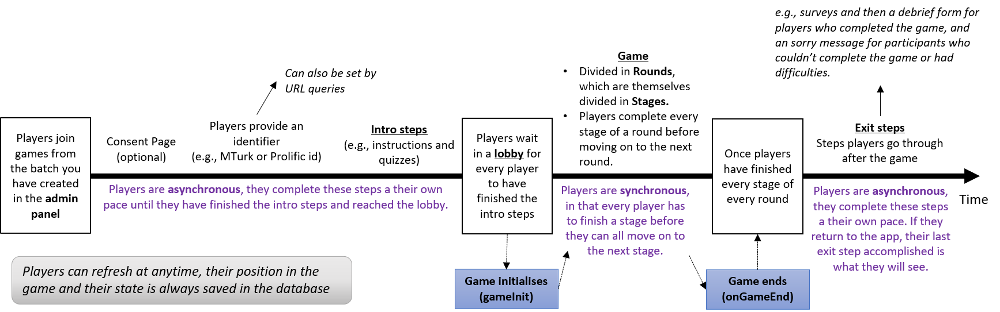

# Game Life Cycle

_Elements on this page refer to the f_[_ile structure_](../structure.md)_,_ [_concepts_](../concepts.md)_, and_ [_API_ ](../api.md)_of an Empirica experiment._

Empirica experiments are event driven. The image below summarizes the lifecycle from the beginning of a game through exit steps.

### Beginning and intro steps

In the admin panel, you would create a Batch of games for players to join. Players enter the game where they go through a consent form \(optional\), they provide an identifier \(which can be set via URL queries\), and they do the intro steps \(the instructions and other components you have set in the intro steps. All of these are set by you in the `./client` . During these steps, players are **asynchronous**; namely, they complete these steps at their own pace until they have finished them, independent from the pace of other players.

### gameInit

Once players finish the intro steps they are sent to a lobby where they wait until every player has joined. When every player has joined, the Game object is created based on what is set in `./server/main.js` in the  `Empirica.gameInit()` . This is where certain parameters are set, and where the Rounds and their Stages are created.

In the `./server/callbacks.js`, `Empirica.onGameStart()` is also triggered at the same time as `Empirica.gameInit()`. Any pre-game preparations can be done in either `gameInit` or `onGameStart` interchangeably. It might make sense to the Game designer to split the overall **mandatory** Game configuration \(Rounds and Stages\) in `gameInit`, from data initialization \(using `set` on Game, Players, Rounds and Stages objects\) in `onGameStart`, but it is not required.

### Rounds and Stages

Then players go through each Stage of each Round. Once a Stage is finished, they move on to the next. If this was the last Stage of a Round, they move on to the next Round. If this was the last Round, they move on to the Exit Steps. 

During these steps, players are **synchronous**; namely, every player has to finish each stage before they can all move on to the next.

In the `./server/callbacks.js`,  a series of callbacks are triggered during this process: 

* Before a round starts, [`onRoundStart`](http://localhost:3000/docs/api#empiricaonroundstartcallback) is called.
* Before a stages starts, [`onStageStart`](http://localhost:3000/docs/api#empiricaonstagestartcallback)is called. 
* When a Stage ends, [`onStageEnd`](http://localhost:3000/docs/api#empiricaonstageendcallback) is called. 
* When a Round ends, [`onRoundEnd`](http://localhost:3000/docs/api#empiricaonroundendcallback)is called.

See our guide on customising when player submit a stage:



### Game end and exit steps

Finally, when the last Round ends, after the end of Stage and Round callbacks are triggered, the [`onGameEnd`](http://localhost:3000/docs/api#empiricaongameendcallback) callback is called in the `./server/callbacks.js`.

After which, the players goes through the exit steps. During these steps, players are **asynchronous**; namely, they complete these steps at their own pace until they have finished them, independent from the pace of other players.

### List of callbacks

The list of callbacks goes as follows in order:

* `gameInit` Required
* `onGameStart`
* `onRoundStart` Repeated for each Round
* `onStageStart` Repeated for each Stage
* `onStageEnd` Repeated for each Stage
* `onRoundEnd` Repeated for each Round
* `onGameEnd`

